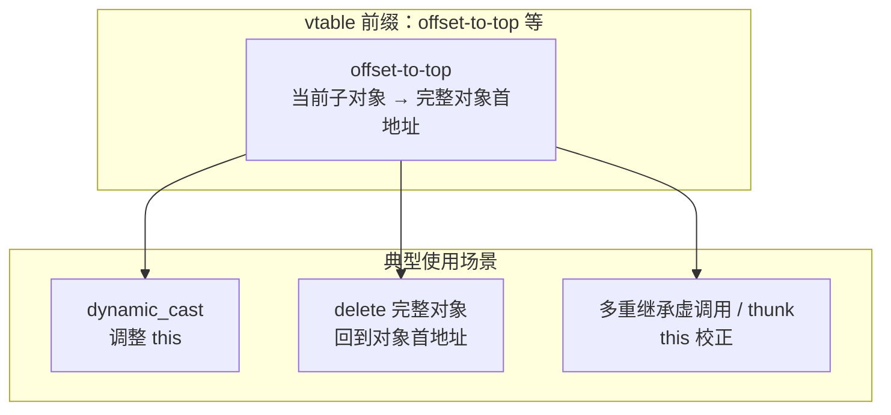
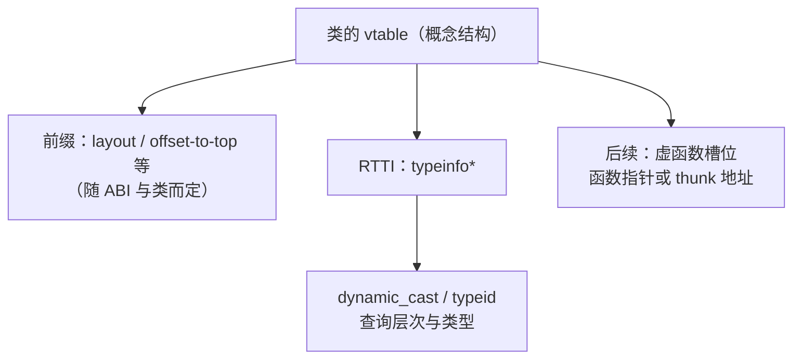
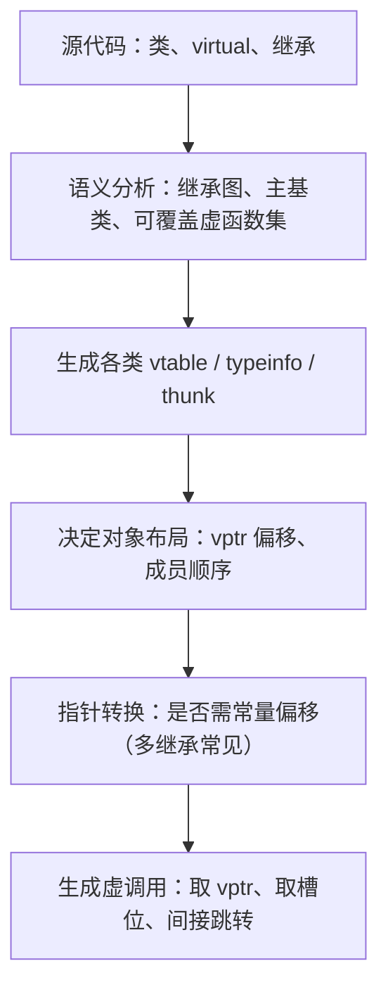
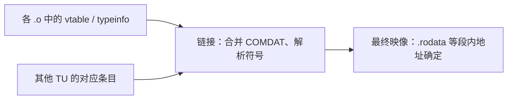
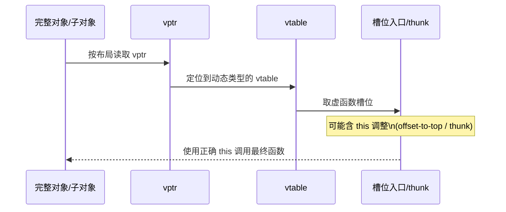

> **原文（维护源）**：[VIRTUAL_FUNCTION_GUIDE.md](https://github.com/Andersonhere/WorkGuide/blob/master/modern_cpp/virtualfunc/vtable-demo/VIRTUAL_FUNCTION_GUIDE.md)（修订以仓库内该文件为准；本文为发布副本。）
>
> **配套示例与源码目录**：[modern_cpp/virtualfunc/vtable-demo/](https://github.com/Andersonhere/WorkGuide/tree/master/modern_cpp/virtualfunc/vtable-demo)

# C++ 虚函数 (Virtual Function) 完整指南

## 目录

1. [虚函数基础](#1-虚函数基础)
2. [为什么需要虚函数：动机与编译链接过程](#2-为什么需要虚函数动机与编译链接过程)
3. [虚函数在对象中的位置与生命周期阶段](#3-虚函数在对象中的位置与生命周期阶段)
4. [三阶段实现：编译期、链接期、运行期](#4-三阶段实现编译期链接期运行期)
5. [虚表 (vtable) 存放规则](#5-虚表-vtable-存放规则)
6. [虚表指针 (vptr)](#6-虚表指针-vptr)
7. [跨动态库边界的对象拷贝问题](#7-跨动态库边界的对象拷贝问题)
8. [崩溃原理详解](#8-崩溃原理详解)
9. [为什么不卸载动态库也可能出问题](#9-为什么不卸载动态库也可能出问题)
10. [内存布局演示](#10-内存布局演示)
11. [常见易错点与补充辨析](#11-常见易错点与补充辨析)
12. [总结与最佳实践](#12-总结与最佳实践)

---

## 1. 虚函数基础

### 1.1 什么是虚函数？（定义与多态含义）

**虚函数**是被 `virtual` 关键字修饰的成员函数，具有被派生类**重写（override）**的特性；该特性用于实现 C++ 的**运行时多态**。

**多态（此处指子类型多态）**：**基类类型的指针或引用**可以指向**派生类对象的存储**；通过该基类指针/引用调用在基类中声明为虚的成员函数时，实际执行的是**动态类型**上最终生效的版本（可能是派生类重新实现过的实现）。

> 注意：只有通过**指针或引用**调用虚函数时，才发生上述动态分派；按值使用基类类型可能导致**对象切片**，见第 3.5 节与第 11.3 节。

### 1.2 虚函数的典型用法

```cpp
Base* base = new Derived();
base->func();

Derived d;
Base2* base2 = &d;   // 或多重继承中另一基类子对象的地址
base2->func();
```

要点：`base` 的**静态类型**是 `Base*`，**动态类型**由实际指向的对象决定；`func` 在 `Base` 中为虚函数时，`base->func()` 走动态分派。

### 1.3 示例：多重继承下不同基类指针与对象首地址

下面示例用于观察：**完整派生类对象的首地址**，与各**基类子对象**首地址在多重继承中通常**不相同**（与单继承中“派生对象首地址常等于第一个基类子对象首地址”形成对照）。其中 `A::f1` 为非虚成员函数，`B` 中声明的 `virtual void f1()` **并不覆盖** `A::f1`（基类中同名函数非虚时，派生类用 `virtual` 重新声明属于**隐藏 + 在 B 的虚表中新增一条与 A::f1 无关的虚函数槽位**），复习时务必区分“同名”与“构成 override”。

```cpp
#include <cstdio>
#include <iostream>

class A {
public:
    void f1() { printf("A::f1\n"); }
    virtual void f2() { printf("A::f2\n"); }
    virtual void f2_A() { printf("A::f2\n"); }
    int a;
    char ac;
};

class B : public A {
public:
    virtual void f1() { printf("B::f1\n"); }
    virtual void f2() { printf("B::f2\n"); }
    int b;
};

class C : public A {
public:
    virtual void f2() { printf("C::f2\n"); }
    int c;
};

class D : public C, public B {
public:
    virtual void f1() { printf("D::f1\n"); }
    virtual void f2() { printf("D::f2\n"); }
    virtual void f_d() { printf("D::f_d\n"); }
};

int main() {
    D d;
    A* p = (C*)&d;   // 经由 C 子对象内的 A 基类子对象
    A* ap = (B*)&d;  // 经由 B 子对象内的 A 基类子对象
    B* bp = &d;
    C* cp = &d;
    std::cout << "&d p:" << &d << std::endl;
    std::cout << "A* p:" << p << std::endl;
    std::cout << "A* ap:" << ap << std::endl;
    std::cout << "B* bp:" << bp << std::endl;
    std::cout << "C* cp:" << cp << std::endl;
}
```

运行后一般可观察到：`p`、`ap`、`bp`、`cp` 与 `&d` 的数值关系反映 **Itanium C++ ABI** 下多重继承与**重复基类 `A`** 的布局：指向不同子对象时，`this` 指针需要不同的地址，这与第 4 节中**偏移量、`dynamic_cast`、`delete`、虚调用中的 this 调整**直接相关。

### 虚函数调用原理（小结）

当通过指针或引用调用虚函数时，程序会：
1. 通过对象的 vptr 找到 vtable
2. 从 vtable 中获取实际函数地址（或经 thunk 再调整 `this`）
3. 跳转到该地址执行

这称为**动态分派 (dynamic dispatch)** 或**晚绑定**。

```cpp
class A {
public:
    virtual void func() { std::cout << "A::func" << std::endl; }
};

class B : public A {
public:
    virtual void func() override { std::cout << "B::func" << std::endl; }
};

int main() {
    A* ptr = new B();
    ptr->func();  // 调用 B::func，不是 A::func！
}
```

---

## 2. 为什么需要虚函数：动机与编译链接过程

### 2.1 要解决的核心问题

在只有**非虚成员函数**的类层次里，通过**基类指针/引用**调用成员函数时，编译器按**静态类型**解析函数地址，无法在运行时根据**实际指向的对象类型**选择实现。这会带来两类典型困境：

1. **接口与实现分离**：框架代码只想依赖“形状”“设备”“插件”等抽象概念，却在编译期被迫知道每一个具体子类的函数符号。
2. **可替换性 (Liskov 替换)**：希望“凡是能用基类语义的地方，都能透明地换成派生类对象”，且调用的是**派生类版本**的逻辑。

C 语言里类似需求通常靠**函数指针结构体**手写；C++ 的虚函数把这套约定**标准化、类型安全化**，并与对象布局、构造析构规则绑定在一起。

### 2.2 为什么会被设计出来（设计目标）

可以概括为：在**保持静态类型检查**的前提下，为**继承 + 运行时多态**提供**统一、可移植**的实现模型。

- **统一**：所有多态类用同一套 vptr/vtable 思路（具体布局由 ABI 规定，如 Itanium C++ ABI）。
- **可移植**：不依赖“把对象地址强转成别的类型再调函数”这类易错技巧。
- **与对象模型一体**：多态行为与“这是一个什么类型的完整对象”绑定，而不是散落在外部函数指针里。

### 2.3 从源码到运行：涉及哪些阶段

下面按时间顺序说明**各阶段各自做什么**（概念层面，细节随编译器/ABI/优化级别变化）：

| 阶段 | 大致工作 |
|------|----------|
| **编译** | 为每个多态类生成 **vtable**（函数指针数组、顺序、thunk 等）；为含虚函数的类在对象布局中预留 **vptr** 槽位；将 `ptr->f()` 形式的虚调用编译成“取 vptr → 取槽位 → 间接跳转”的指令序列。 |
| **链接** | 合并各编译单元中的 vtable、类型信息、虚函数体符号；解析跨 TU 的虚函数定义与内联决策等。 |
| **加载** | 可执行文件/动态库映射到进程地址空间，**vtable 位于只读数据段**（通常），地址在该模块映射范围内确定。 |
| **构造/析构** | 在对象生命周期内维护 **vptr 指向“当前构造阶段所对应的动态类型视图”**（见下一节）。 |
| **运行时调用** | 通过 vptr 做**动态分派**；部分情况下编译器可做 **devirtualization**（优化为直接调用）。 |

理解这条流水线，有助于把后文的“跨动态库 memcpy”“dlclose 后崩溃”等问题，还原成**某一步破坏了 vptr 与合法 vtable 之间的映射**。

更细的**编译期 / 链接期 / 运行期**分工与**虚表槽位语义**见第 4 节。

---

## 3. 虚函数在对象中的位置与生命周期阶段

### 3.1 对“对象构成”的影响：多了什么？

对**多态类**（含虚函数，通常也应有虚析构）的对象来说，在**数据成员**之外，实现模型一般会多出：

- **vptr**：指向本动态类型对应的 vtable（常见实现中位于对象首部附近，但**具体偏移由 ABI/编译器决定**，不要手写依赖）。
- **继承树中的多个 vptr**（多重继承、虚继承时更复杂，见后文第 5 节规则 5）。

因此：**对象大小**通常会增加指针大小（或多个）；**默认/隐式生成的特殊成员函数**（构造、析构、赋值）会负责维护 vptr，而不是“只有你自己写的 int 成员才算对象状态”。

### 3.2 构造阶段：vptr 何时指向谁？

对象不是一瞬间变成“完整的派生类”的，而是**按基类子对象 → 成员 → 派生类体**逐步长出来。与虚函数相关的要点：

- 在**基类构造函数执行期间**，对象的动态类型视为**正在构造的那个基类**；此时若通过**虚调用**（注意：不是从构造函数里直接静态调用非虚函数）调用虚函数，一般会解析到**当前基类版本**，而不是最终派生类版本。
- 进入**派生类构造函数**后，vptr 会更新为派生类（及后续基类子对象）对应的布局，直到整个对象构造完成。

**复习结论**：在基类/成员构造阶段写“依赖多态已完成”的逻辑，容易踩坑。**构造期内**若只是要**复用同一段初始化代码**，应抽成 **`private`/`protected` 非虚**辅助函数（或自由函数），**不要**指望在基类构造函数里通过虚函数调到“已经写好的派生类版本”。需要派生类按固定骨架参与、且**必须走虚函数**的那部分，应放到**构造完成之后**再触发（例如显式 `init()` / `start()`，或首次调用业务入口）。**对象建好以后**，若仍希望“基类掌握总流程、派生类只填某几步”，常用 **NVI**（非虚 `public` 模板方法 + `protected virtual` 钩子）——它解决的是**构造完成后的接口形态**，并不能让基类构造里的虚调用自动变成派生类实现。

### 3.3 析构阶段：与构造对称

- 析构函数开始执行时，vptr 仍指向**当前正在析构的类型**的视图；随着基类析构展开，vptr 会逐步回到基类 vtable。
- 因此：**在析构函数里通过虚调用调用别的接口**，同样可能只落到**当前类型或基类**版本，而不是“你以为还完整存在的派生类状态”。

**实践要点**：基类析构应 **`virtual`（或 protected non-virtual + 约束使用方式）**；若基类可能被多态删除却无虚析构，属于经典未定义行为温床。

### 3.4 赋值与拷贝：vptr 不是“随便 memcpy 的字段”

- **同类型**的拷贝/移动：编译器生成的特殊成员会正确复制数据成员，并保持 vptr 指向**正确类型的 vtable**（你通常不需要手动碰 vptr）。
- **错误地把 A 类型内存按位拷进 B 类型对象**（尤其跨模块、跨布局）：会破坏 vptr 与数据成员的一致性，后文第 7 节即典型场景。

### 3.5 与“对象切片 (slicing)”的关系

**按值**传递/返回基类，而实际对象是派生类时，会发生**切片**：只复制基类子对象部分，**派生特有成员丢失**；同时 vptr 会调整为基类视图。这与“虚函数机制本身”配套出现，是多态代码里常见的逻辑错误来源。

---

## 4. 三阶段实现：编译期、链接期、运行期

本节把**多态在单继承下的实现**按**编译期、链接期、运行期**展开，并给出 GCC **`-fdump-lang-class`** 的虚表与对象布局导出示例；文中关于**槽位 0 / 槽位 1**、**`dynamic_cast` / `delete` / 多重继承虚调用的 this 调整**的叙述与参考笔记一致。原始笔记中的外链流程图（语雀 Mermaid 导出 SVG）在本地仓库未托管时可能失效，此处用 **Mermaid 源码图**表达同等流程关系。

> **与第 8 节的关系**：第 8 节为便于理解，把“从对象首地址读出、再经一次间接”的叙述做了教学化简化；本节补充 **Itanium ABI** 下 vtable 前部常见存在 **offset-to-top**、**RTTI(typeinfo)** 等条目，**第一个真正的虚函数指针不一定在“逻辑槽位 0”**。以 `g++ -fdump-lang-class` 为准做实验最稳妥。

### 4.1 单继承最小示例

```cpp
#include <cstdio>

class A {
public:
    void f1() { printf("A::f1\n"); }
    virtual void f2() { printf("A::f2\n"); }
};

class B : public A {
public:
    virtual void f1() { printf("B::f1\n"); }
    virtual void f2() { printf("B::f2\n"); }
};

int main() {
    A* a = new B();
    (void)a;
    return 0;
}
```

以下分别从**编译期、链接期、运行期**说明各阶段为多态机制做了哪些工作。

### 4.2 编译期

#### 4.2.1 使用 `-fdump-lang-class` 查看虚表与布局

```bash
g++ -fdump-lang-class -c func.cpp -o func_tmp
```

使用该参数可得到**虚表的可视化结构**、**虚表指针相对对象首地址的偏移**、各**虚函数槽位**等信息（具体符号名、条目数随 GCC 版本与类定义略有差异，以本机输出为准）。

下面是一段**示意性**的导出片段（与参考笔记中的结构对应，用于说明各字段含义；你本机地址与符号名会不同）：

```text
Vtable for A
A::_ZTV1A: 3 entries
0     (int (*)(...))0                    // 到“完整对象顶部”的偏移（此处 A 即完整对象，常为 0）
8     (int (*)(...))(& _ZTI1A)          // RTTI：指向 A 的 typeinfo
16    (int (*)(...))A::f2               // 虚函数 f2 的槽位（相对 vtable 地址的偏移由实现决定）
// f1 不是虚函数，不在虚表中

Class A
   size=8 align=8
   base size=8 base align=8
A (0x...) 0 nearly-empty
    vptr=((& A::_ZTV1A) + 16)           // 对象内的 vptr 指向“含可调用函数指针的那段 vtable 前缀”之后的位置（实现细节）

Vtable for B
B::_ZTV1B: 4 entries
0     (int (*)(...))0
8     (int (*)(...))(& _ZTI1B)
16    (int (*)(...))B::f2               // B 对 f2 的覆盖
24    (int (*)(...))B::f1               // B 新增的虚函数 f1（与 A::f1 无多态覆盖关系）
// 在 A 的虚表布局基础上扩展；被覆盖的虚函数在对应槽位填入派生类实现

Class B
   size=8 align=8
   base size=8 base align=8
B (0x...) 0 nearly-empty
    vptr=((& B::_ZTV1B) + 16)
A (0x...) 0 nearly-empty
      primary-for B (0x...)             // A 是 B 的主基类；B 的虚表在 A 的布局上扩展
```

**编译期小结**：编译器为**每个多态类**生成对应的**虚函数表**，其中除函数指针外，通常还包含：

- **到顶部的偏移（offset-to-top，常出现在 vtable 前缀区域）**：表示从**当前基类子对象地址**到**完整对象（most-derived object）起始地址**的偏移。在下列场景会用到该偏移量（与参考笔记一致）：
  - **`dynamic_cast`**：在基类指针间转换或向下转换时，用于**调整 `this` 指针**指向正确的子对象。
  - **`delete`**：通过某基类指针删除完整对象时，需要把指针**调整回完整对象首地址**，才能正确调用析构函数与释放内存。
  - **虚函数调用（尤其多重继承）**：派生类重写基类虚函数时，入口可能为 **thunk**：先根据偏移把 `this` 调整到当前子对象或完整对象，再进入真实函数体。



- **第 1 类元数据槽位：RTTI（`typeinfo` 指针）**：与 **`typeid`**、**`dynamic_cast`** 的运行时类型识别密切相关，是实现 C++ **运行时类型识别**与多态基础设施的一部分。



#### 4.2.2 对象创建与指针类型的编译期准备

对于：

```cpp
Base* p = new Derived();
```

编译期会：

- 做**类型检查**（能否将 `Derived*` 转为 `Base*` 等）；
- 根据**继承关系与布局模型**，决定在何种情况下需要对子对象地址做**固定偏移**（典型于**多重继承**、或非主基类子对象）；
- 在**单继承**且 `Derived` 单一主基类为 `Base` 的常见情形下：**`Derived` 对象首地址与 `Base` 子对象首地址相同**，因此 `Base*` 与 `Derived*` 可能**数值相等**。

```cpp
class Base { /* ... */ };
class Derived : public Base { /* ... */ };

Derived d;
Base* b = &d;

// 常见布局下（单继承、主基类在首址）：
// &d == b  为 true
```



### 4.3 链接期

链接器将各编译单元（`.o`）中**重复或需合并**的 vtable、RTTI、虚函数符号按 **COMDAT 合并规则**等策略合并，并为 vtable 在最终可执行文件/动态库映像的**只读数据段**中分配**最终地址**。仅观察编译期 `-fdump-lang-class` 产物，也能反推出多态实现的大半机制；链接期负责把“每 TU 一份的草图”落实为“进程内唯一的只读表”。



### 4.4 运行期

运行时执行虚调用的核心步骤是：

1. 从对象（或某基类子对象）首址按已知偏移取出 **vptr**；
2. 通过 vptr 找到本动态类型对应的 **vtable**；
3. 按槽位取出**虚函数入口**（可能是**直接函数地址**，也可能是会先调整 `this` 的 **thunk**）；
4. 在**多重继承**等场景下，结合 **offset-to-top** 等信息，把 `this` 调整到**完整对象首地址**或**正确子对象首地址**，再进入实际函数体。



---

## 5. 虚表 (vtable) 存放规则

### 规则 1: 每个有虚函数的类只有一个 vtable

```
类 A:
┌─────────────────────────────────────────┐
│  vtable A (所有 A 的对象共享)           │
│  [0] A::vfunc1                         │
│  [1] A::vfunc2                         │
└─────────────────────────────────────────┘

A 对象1 ──→ vptr ──→ vtable A
A 对象2 ──→ vptr ──→ vtable A (相同!)
```

### 规则 2: vtable 存储在可执行文件/动态库的只读数据段

- **不是**在堆或栈上
- 在程序加载时创建，整个生命周期内存在
- 主程序和动态库各有自己的 vtable

### 规则 3: vtable 的内容顺序是声明顺序

```cpp
class A {
    virtual void vfunc1();  // [0]
    virtual void vfunc2();  // [1]
};

class B : public A {
    virtual void vfunc1() override; // [0] 覆盖父类
    virtual void vfunc3();          // [1] 新增
};
```

### 规则 4: 重写的函数会替换 vtable 中的对应槽位

```
A::vtable:
  [0] A::vfunc1
  [1] A::vfunc2

B::vtable:
  [0] B::vfunc1  ← 覆盖!
  [1] A::vfunc2  ← 保持不变
  [2] B::vfunc3  ← 新增
```

### 规则 5: 多重继承 - 每个基类子对象都有自己的 vptr

```
class D1 { virtual void f1(); };
class D2 { virtual void f2(); };
class Multi : public D1, public D2 { ... };

Multi 对象内存:
┌─────────────────────┐
│  vptr (D1 部分)     │ ──→ vtable for D1
├─────────────────────┤
│  D1 数据            │
├─────────────────────┤
│  vptr (D2 部分)     │ ──→ vtable for D2
├─────────────────────┤
│  D2 数据            │
├─────────────────────┤
│  Multi 数据         │
└─────────────────────┘
```

---

## 6. 虚表指针 (vptr)

### vptr 是对象的一部分

每个包含虚函数的类的对象，在内存开头都有一个 vptr：

```
B 对象内存布局:
┌─────────────────────┐  ← 地址最低
│  vptr (8 bytes)     │  ← 指向 B 的 vtable
├─────────────────────┤
│  a_data (4 bytes)   │  ← 继承自 A
├─────────────────────┤
│  b_data (4 bytes)   │  ← B 自己的
└─────────────────────┘
```

### 读取 vptr

```cpp
class B { virtual void func(); int data = 0xBEEF; };

B b;
void* vptr = *(void**)&b;  // 读取 vptr
```

---

## 7. 跨动态库边界的对象拷贝问题

### 危险代码示例

**dynamic.cpp (动态库)**
```cpp
class D {
public:
    virtual void func() {
        std::cout << "D's func in SO" << std::endl;
    }
};

extern "C" D* create_D() { return new D(); }
extern "C" void free_D(D* d) { delete d; }
```

**main.cpp (主程序)**
```cpp
class B {
public:
    virtual void func() {
        std::cout << "B's func in Main" << std::endl;
    }
};

int main() {
    void* handle = dlopen("./libdynamic.so", RTLD_LAZY);
    create_D_func create_D = (create_D_func)dlsym(handle, "create_D");

    B b;                    // 主程序对象，vptr 指向主程序的 vtable
    D* d = create_D();      // 动态库对象，vptr 指向动态库的 vtable

    // 危险操作!
    memcpy(&b, d, sizeof(B));  // 把 d 的内存拷贝到 b

    dlclose(handle);
    b.func();  // 崩溃!
    return 0;
}
```

### 内存变化对比

| 阶段 | b.vptr | 说明 |
|------|--------|------|
| 拷贝前 | `0x5650...` (主程序地址空间) | 正常 |
| 拷贝后 | `0x7f1f...` (动态库地址空间) | 被覆盖! |
| dlclose 后 | `0x7f1f...` (野地址!) | 内存已释放 |

---

## 8. 崩溃原理详解

### 表达式分析

```cpp
FuncType func_ptr = *(FuncType*)*(void**)&b;
```

逐步解析：

| 步骤 | 表达式 | 结果 | 说明 |
|------|--------|------|------|
| 1 | `&b` | `0x7ffc4f9e4710` | 对象的起始地址 |
| 2 | `(void**)&b` | 同上 | 指向 vptr 本身 |
| 3 | `*(void**)&b` | `0x7f056ba20dd8` | vptr 的值，指向 vtable |
| 4 | vtable[0] | `0x7f056ba1e2a4` | 第一个虚函数地址 |
| 5 | `*(FuncType*)vptr` | `0x7f056ba1e2a4` | 函数指针 |

> **教学提示**：上表把“vtable 中第一个可当作函数指针解引用的槽位”记为 `vtable[0]` 以突出**间接调用链**；在 **Itanium ABI** 中，vtable 开头常见还有 **offset-to-top**、**typeinfo** 等元数据槽位，真实索引需以 `-fdump-lang-class` 或反汇编为准，见第 4 节。

### 图示

```
┌─────────────────────────────────────────────────────────────┐
│                      动态库内存                              │
│  ┌─────────────────┐                                       │
│  │  vtable         │ ← vptr 指向这里                       │
│  ├─────────────────┤                                       │
│  │  vtable[0]      │ ← 函数地址                            │
│  └─────────────────┘                                       │
│  动态库卸载后，这里变为未映射内存                            │
└─────────────────────────────────────────────────────────────┘

┌─────────────────────────────────────────────────────────────┐
│                      主程序内存                              │
│  ┌─────────────────┐                                       │
│  │  vptr=0x7f...d8 │ ← 指向动态库的 vtable（已卸载!）      │
│  ├─────────────────┤                                       │
│  │  data           │                                        │
│  └─────────────────┘                                       │
└─────────────────────────────────────────────────────────────┘

调用 func_ptr() 时:
  1. 从 0x7f...d8 读取 vtable      → SIGSEGV!
  2. 从 vtable[0] 获取函数地址
  3. 跳转到该地址执行
```

---

## 9. 为什么不卸载动态库也可能出问题

即使不调用 dlclose()，也是未定义行为！

### 测试结果

| 调用方式 | 输出 | 说明 |
|---------|------|------|
| 直接调用 `b.func()` | B's func in Main | 编译器 devirtualization |
| 通过指针 `pb->func()` | D's func in SO | 走 vptr，调用错误函数 |
| 通过函数指针 | D's func in SO | 走 vptr，调用错误函数 |

### 为什么不会崩溃？

- vtable 内存仍有效（动态库未卸载）
- 虚函数地址可解析

### 但这是严重问题！

1. **类型安全破坏** - B 和 D 是完全不同的类
2. **行为不可预测** - 编译器优化导致不同调用方式结果不同
3. **依赖隐式约定** - 代码依赖动态库保持加载
4. **ABI 兼容风险** - 不同编译器/平台的 vtable 布局不同

---

## 10. 内存布局演示

运行 `memory_layout` 查看详细内存变化：

```
=== b (拷贝前) ===
内存: 10 fd 8b 02 50 56 00 00 ef be 00 00 00 00 00 00 
vptr: 0x5650028bfd10 (主程序)
data: 0xbeef

=== d (动态库对象) ===
内存: d8 ed 06 4d 1f 7f 00 00 00 00 00 00 
vptr: 0x7f1f4d06edd8 (动态库)
data: 0x0

>>> memcpy(&b, d, sizeof(B)) >>>

=== b (拷贝后) ===
内存: d8 ed 06 4d 1f 7f 00 00 00 00 00 00 00 00 00 00 
vptr: 0x7f1f4d06edd8 ← 指向动态库!
data: 0x0 ← 被覆盖!
```

---

## 11. 常见易错点与补充辨析

### 11.1 基类析构未声明 `virtual`

通过基类指针 `delete` 派生类对象时，若基类析构非虚，**未定义行为**（可能只执行基类析构、泄漏资源、或更糟）。多态基类应 **`virtual ~Base() = default;`**（或 `= 0` 的接口基类配合 `= default` 的 protected 实现等模式）。

### 11.2 在构造/析构函数中调用“尚未成立/已销毁”的多态

见第 3.2、3.3 节：构造/析构期间**动态类型是分阶段的**，不要假设“已经是最终派生类”。

### 11.3 对象切片 (slicing)

按值保存/传参基类导致派生状态丢失；若还需要多态行为，应使用**指针/引用**或**智能指针**。

### 11.4 隐藏 (hiding) 与 `override`

派生类声明了与基类**同名不同参**的非虚函数，会**隐藏**基类重载；与 `override` 无关。`override` 用于**显式表达“我在覆盖虚函数”**，签名不匹配时编译报错。

**补充（与第 1.3 节示例呼应）**：若基类中同名函数**非虚**，派生类里即使写了 `virtual void f1()`，也不构成对基类 `f1` 的 override；`A*` 通过静态类型调用 `f1()` 仍解析为 `A::f1`，而 `B*`/`D*` 路径上的虚表可能另有 `B::f1` 槽位。复习时应用 **`override`** 并在基类有意多态的接口上标明 **`virtual`**，避免“同名不同机制”混淆。

### 11.5 `virtual` 与 `static` / 构造函数

- **静态成员函数**不能是 `virtual`（没有 `this`，无动态分派载体）。
- **构造函数**不能是 `virtual`（对象类型尚未完整建立）。

### 11.6 `final` 与协变返回类型

- `final` 可终止继承或终止虚函数进一步覆盖，用于性能与契约收紧。
- 覆盖虚函数时返回类型可**协变**为派生类指针/引用（有规则限制）；返回无关类型会失败。

### 11.7 与模板静态多态对比（复习锚点）

- **虚函数**：运行时多态，通常有间接调用与 vtable 开销（可被优化）。
- **CRTP / 概念约束 + 模板**：编译期多态，无 vtable，但编译期耦合与代码膨胀不同。二者不是替代关系，而是取舍。

### 11.8 本文档演示类相关的现实提醒

- **不要**跨模块 `memcpy` 含 vptr 的对象；**不要**假设不同编译单元里“同名类”布局一致。
- 插件边界优先 **PIMPL、纯虚接口 + 工厂、stable C API** 等模式，把布局与 vtable 留在**同一模块内**管理。

---

## 12. 总结与最佳实践

### 核心结论

| 规则 | 说明 |
|------|------|
| vtable 是**类级别**的 | 同一类的所有对象共享 |
| vtable 是**只读**的 | 编译器生成，运行时不可修改 |
| vtable 存放在**可执行文件/动态库**的数据段 | 每个模块有自己的 vtable |
| vptr 是**对象级别**的 | 每个对象有自己的 vptr |
| 动态库的 vtable 在**动态库地址空间** | 卸载后不再有效 |

### 最佳实践

1. **禁止跨动态库边界 memcpy 对象**
   - 对象内存包含 vptr，指向其他模块的 vtable
   - 拷贝后 vptr 指向无效地址

2. **禁止将动态库中的对象地址暴露给主程序直接使用**
   - 使用接口/代理模式
   - 或使用 COM 等标准跨模块通信机制

3. **使用 -fvisibility=hidden 隐藏符号**
   - 减少全局符号冲突
   - 提高安全性

4. **谨慎使用 dlclose**
   - 确保没有对象仍在使用动态库的 vtable
   - 考虑使用 reference counting

### 正确做法示例

```cpp
// 错误做法 (危险!)
memcpy(&b, d, sizeof(B));  // 禁止!

// 正确做法 1: 使用接口
class IInterface {
public:
    virtual ~IInterface() = default;
    virtual void func() = 0;
};

// 正确做法 2: 使用工厂函数返回指针
extern "C" IInterface* create_object();
```

---

## 文件说明

| 文件 | 说明 |
|------|------|
| `dynamic.cpp` | 动态库源码，定义类 D |
| `main.cpp` | 主程序，演示崩溃版本 |
| `test_no_close.cpp` | 不卸载动态库的测试 |
| `memory_layout.cpp` | 内存布局演示 |
| `vtable_rules.cpp` | vtable 规则演示 |
| `explain_crash.cpp` | 崩溃原理详解 |
| `libdynamic.so` | 编译后的动态库 |

## 编译命令

```bash
# 编译动态库
g++ -shared -fPIC -o libdynamic.so dynamic.cpp

# 编译主程序
g++ main.cpp -o main -ldl

# 内存布局演示
g++ memory_layout.cpp -o memory_layout -ldl

# vtable 规则演示
g++ vtable_rules.cpp -o vtable_rules

# 查看类的虚表与布局（生成 *.class 等 dump 文件）
g++ -fdump-lang-class -c your.cpp -o your_tmp
```
